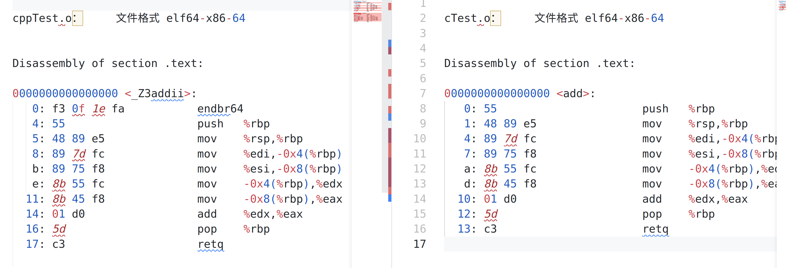

### [C和C++混合编程超详细讲解](https://blog.csdn.net/weixin_42031299/article/details/126688788?ops_request_misc=&request_id=&biz_id=102&utm_term=c++%E5%85%A5%E9%97%A8%20c%E5%92%8Cc++%E6%B7%B7%E5%90%88%E7%BC%96%E8%AF%91&utm_medium=distribute.pc_search_result.none-task-blog-2~all~sobaiduweb~default-0-126688788.142^v86^koosearch_v1,239^v2^insert_chatgpt&spm=1018.2226.3001.4187)

#### 1、为什么需要C和C++混合编程

- C++是在C语言的基础上发展出来的，在C++发明之前已经用C语言实现了很多功能库，C++要使用这些库就涉及到调用C语言；
- C++和C语言各自有更适合的领域，在大型项目中都需要使用，涉及到C和C++的互相调用。比如嵌入式设备开发中，应用层开发、算法开发中使用C++，底层的操作系统、音视频开发使用C语言；

#### 2、为什么不同的语言可以混合编程

- 程序编译的过程：高级语言->汇编语言->二进制代码->链接->可执行程序->烧录镜像；
- 任何语言最终都要变成二进制的可执行程序才能在CPU上运行，不同的高级语言在编译成汇编语言的过程是不一样的，所以每种高级语言都有自己的编译器；
- 不管哪种高级语言在汇编语言阶段或者二进制代码阶段时都是一样的格式，互相之间是可以调用的，也就是我们常看到的库文件，开发中常把代码编译成库供其他人调用；
- 高级语言的目标都是编译成汇编指令，汇编指令是和CPU相关而与高级语言无关，所以CPU相同的情况下，每种高级语言在汇编阶段都是统一的；

#### 3、C和C++混合编程的困难

##### 3.1、C++的函数重载带来的麻烦

- C和C++之间互相调用是根据函数名进行，在链接时通过函数名将函数对应的二进制代码链接起来；
- C++支持函数重载：C++中可以有相同名字的函数，只要同名函数的传参不同，C++就不会报错，并根据调用时的传参来选择调用对应的函数；
- 在符号表中，C语言的函数名是不考虑传参的，但是C++的函数名是和传参类型有关的，这就导致通一个函数在C和C++中函数名不一致，也就会导致在链接时找不到函数的报错；

##### 3.2、验证C++的函数重载机制

###### 3.2.1、C++代码

```cpp
//cppTest.cpp

int add(int a, int b)
{
  return a+b;
}

float add(float a, float b)
{
  return a+b;
}
```

###### 3.2.2、C代码

```c
//cTest.c

int add(int a, int b)
{
	return a+b;
}
```

###### 3.2.3、编译成汇编代码

```bash
//得到c代码对应的汇编代码
gcc -c cTest.c -o cTest.o
objdump -d cTest.o > cTest.i

//得到c++代码对应的汇编代码
g++ -c cppTest.cpp -o cppTest.o
objdump -d cppTest.o > cppTest.i
```

###### 3.2.4、实验结果分析



- C++支持函数重载，所以可以在C++代码中定义两个同名但传参不同的函数，函数名分别叫 `_Z3addii`和 `_Z3addff`，其中最后两个字母和传参有关，`ii`表示两个传参都是 `int`型，`ff`表示两个传参都是 `float`型；
- 通过对比，在 `C`和 `C++`中 `int add(int a, int b)`函数的汇编代码都是一样的，不同的是函数名称，在 `C`语言中是 `add`，在 `C++`中是 `_Z3addii`；
- 经过实现可知，如果不经过任何处理，虽然 `C`和 `C++`都定义了同样的 `add`函数，但是经过编译后得到的汇编代码中函数名称却不同，这会导致链接时找不到函数；

#### 4、解决函数重载带来的不兼容性

##### 4.1、解决思路

- 函数重载机制是C++的特性，而C语言并没有，根据向前兼容原则，需要C++去兼容C，而不能要求C语言去支持函数重载机制；
- 解决方法就是**C++在需要和C对接的局部不采用函数重载机制，向C兼容；**
- 在C++中，`用extern “C”{}括起来的内容表示向C兼容`，不要使用函数重载机制；

注意点：`extern “C”{}`是C++中支持的，在C中是没有 `extern “C”{}`这个用法的，C语言使用编译会报错；

##### 4.2、`extern “C”{}`使用示例

```cpp
#ifdef __cplusplus
extern "C"{
#endif

	······

#ifdef __cplusplus
}
#endif
```

- `__cplusplus`是 `C++`中的宏，表示当前是 `C++`的编译环境；
- 上面实现的效果就是在 `C++`的编译环境中就使用 `extern “C”{}`向 `C`语言兼容，如果不是 `C++`的编译环境就不使用 `extern “C”{};`

#### 5、混合编程的情况

##### 5.1、`C++调用C`：`C`是库

**C函数代码：`cTest.c`**

```c
int add(int a, int b)
{
	return a+b;
}
```

**C头文件：`cTest.h`**

```c
#ifndef __CTEST_H__
#define __CTEST_H__

#ifdef __cplusplus
extern "C"{
#endif

int add(int a, int b);

#ifdef __cplusplus
}
#endif

#endif

```

**C++调用代码：`cppTest.cpp`**

```cpp
#include <iostream>
#include "cTest.h" 

using namespace std;

int main()
{
	int a = 1;
	int b= 2;

	cout << add(a, b) << endl;

	return 0;
}
```

编译链接代码

**使用 `extern “C”{}`**

```bash
[root#]$ ls
cppTest.cpp  cTest.c  cTest.h  
[root#]$ 
[root#]$ gcc -c cTest.c -o cTest.o
[root#]$ 
[root#]$ ar -r libcTest.a cTest.o
ar: creating libcTest.a
[root#]$ 
[root#]$ g++ cppTest.cpp -L. -lcTest
[root#]$ 
[root#]$ ls
a.out  cppTest.cpp  cTest.c  cTest.h  cTest.o  libcTest.a
[root#]$ 
[root#]$ ./a.out 
3

```

**不使用 `extern “C”{}`**

```bash
root#]$  g++ cppTest.cpp -L. -lcTest
/tmp/cc0Wckzc.o: In function `main':
cppTest.cpp:(.text+0x21): undefined reference to `add(int, int)'
collect2: ld returned 1 exit status
```

> 把cTest.h头文件中的extern “C”{}去掉，按照上面的步骤重新再编译执行一遍，会报add函数未定义的错误；

**实验现象分析**

```bash
root#]$ nm libcTest.a 
cTest.o:
0000000000000000 T add
```

- `cTest.h`头文件中没有 `extern “C”{}`去修饰，则会按照函数重载机制去调用 `add`函数，也就是按照 `_Z3addii`符号去 `libcTest.a`中查找函数；
- 用 `nm`命令可以看到，在链接得到的 `libcTest.a`库中只有 `add`名字的函数，所以会报 `add`函数未定义的错误；

**总结**

用C语言写功能库代码时，需要对外提供的函数接口头文件用 `extern “C”{}`括起来，将来库无论被 `C`语言调用还是被 `C++`调用都支持；

##### 5.2、`C调用C++`：`C++`是库

**C++函数代码：`cppTest.cpp`**

```cpp
#include "cppTest.hpp"

int add(int a, int b)
{
	return a+b;
}
```

**C++头文件：`cppTest.hpp`**

```cpp
#ifndef __CPPTEST_HPP__
#define __CPPTEST_HPP__

int add(int a, int b);

#endif
```

**`C调用代码：cTest.c`**

```cpp
#include <stdio.h>
#include "cppTest.hpp" 

int main()
{
	int a = 1;
	int b= 2;

	printf("a+b=%d\n", add(a, b));

	return 0;
}
```

**编译链接代码**

```cpp
[root#]$ g++ cppTest.cpp -c -o cppTest.o
[root#]$ 
[root#]$ ar -r libcppTest.a cppTest.o
ar: creating libcppTest.a
[root#]$ 
[root#]$ gcc cTest.c -L ./ -lcppTest
/tmp/cchDGkJK.o: In function `main':
cTest.c:(.text+0x21): undefined reference to `add'
collect2: ld returned 1 exit status
[root#]$ 
[root#]$ nm libcppTest.a 

cppTest.o:
0000000000000000 T _Z3addii
                 U __gxx_personality_v0

```

- 在编译C语言的可执行程序时，报 `add`未定义的错误，因为在 `C++`实现的 `libcppTest.a`库中并没有用 `extern “C”{}`将对C提供的 `add`函数括起来，这样在编译
- `add`函数时就会用函数重载机制，最终 `add`函数在符号表中是 `_Z3addii`，C语言按照 `add`符号去链接时就会找不到 `add`函数；

冷知识：如果C语言中，按照 `_Z3addii`函数名去调用，是可以成功的；

##### 5.3、解决方案一：直接改C++源码

**`C++头文件增加extern “C”{}`**

```cpp
#ifndef __CPPTEST_H__
#define __CPPTEST_H__

#ifdef __cplusplus
extern "C"{
#endif

int add(int a, int b);

#ifdef __cplusplus
}
#endif

#endif
```

**编译链接得到可执行程序**

```bash
[root#]$g++ cppTest.cpp -c -o cppTest.o
[root#]$
[root#]$ar -r libcppTest.a cppTest.o
[root#]$
[root#]$gcc cTest.c -L. -lcppTest -lstdc++
[root#]$
[root#]$ ./a.out 
a+b=3
[root#]$ nm libcppTest.a 

cppTest.o:
                 U __gxx_personality_v0
0000000000000000 T add
```

修改 `C++`库的代码，将要被 `C`调用的函数头文件用 `extern “C”{}`括起来，兼容 `C`的调用；

##### 5.4、解决方案二：将C++库再封装一层

**使用场景**

- 如果别人给你提供了 `C++`写的代码库，但是写 `C++`代码库的人并没有考虑被 `C`调用的情况，所以给你的库版本并没有用 `extern “C”{}`去兼容C调用；
- 通常对方提供 `.so`动态库，你在没有源码的情况下是无法修改源码并重新编译动态库的，但是你可以对动态库再封装一层，封装的接口用 `extern “C”{}`去括起来；

**封装的 `C++`源文件：`cppPack.cpp`**

```cpp
#include "cppPack.hpp"
#include "cppTest.hpp"

int addPack(int a, int b)
{
	return add(a, b); //自己写一个函数，在这个函数里面写对应的实现
}
```

**封装的 `C++`头文件：`cppPack.hpp`**

```cpp
#ifndef __CPPPACK_HPP__
#define __CPPPACK_HPP__

#ifdef __cplusplus
extern "C"{
#endif

int addPack(int a, int b);

#ifdef __cplusplus
}
#endif

#endif
```

**C调用代码：`cTest`**

```cpp
#include <stdio.h>
#include "cppPack.hpp" 

int main()
{
	int a = 1;
	int b= 2;

	//这里调用封装的addPack函数，addPack函数内部就是调用的add函数
	printf("a+b=%d\n", addPack(a, b));
	return 0;
}
```

**编译链接代码**

```bash
root@ubuntu:# g++ cppPack.cpp -c -o cppPack.o
root@ubuntu:# ar -r libcppPack.a cppPack.o
root@ubuntu:# gcc cTest.c -L ./ -lcppPack -lcppTest -I ./
```
